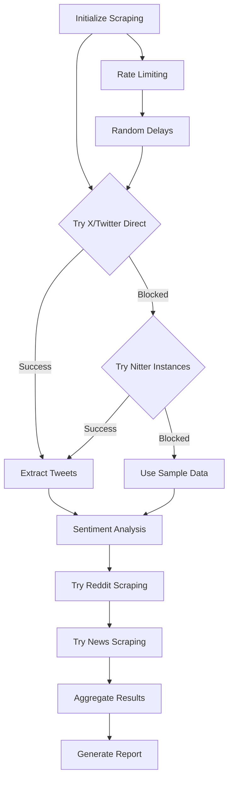

# CrewAI Financial Intelligence System

A comprehensive backend system using CrewAI framework for sentiment analysis and SEC insider trading monitoring with web scraping capabilities, advanced LLM integration, and RAG capabilities.

## 🚀 Features

- **Real-time SEC Filings Analysis** - Monitors Forms 8-K, 10-Q, 10-K, and Form 4 filings
- **Insider Trading Pattern Recognition** - Distinguishes between planned (10b5-1) and discretionary trades
- **Web Scraping Sentiment Analysis** - Scrapes X (Twitter) and alternative social media sources using requests + BeautifulSoup
- **Alternative Data Sources** - Reddit financial communities, news aggregation, and public forums
- **RAG Integration** - ChromaDB vector store with historical document context
- **LLM-Enhanced Insights** - GPT-powered analysis for deeper market intelligence
- **Professional Visualizations** - Comprehensive charts with matplotlib and seaborn
- **Multi-format Reports** - Generates both Markdown and PDF reports with embedded charts
- **CrewAI Flow with Guardrails** - Robust error handling and process validation

## 📋 Requirements

### Python Dependencies

```bash
pip install crewai litellm requests beautifulsoup4 matplotlib pandas seaborn
pip install python-dotenv reportlab textblob transformers torch
pip install chromadb sentence-transformers langchain-community faiss-cpu
```

### Environment Variables

Create a `.env` file in the project root:

```env
OPENAI_API_KEY=your-openai-api-key-here
# Twitter API no longer required - using web scraping instead
```

**Note**: The system uses web scraping instead of Twitter API, with fallback sample data when scraping is blocked.

## 🏗️ Project Structure

```
crewai-trading-system/
├── crewai_trading_system.py    # Main application
├── twitter_scraper_tool.py     # Web scraping module
├── .env                        # Environment variables
├── README.md                   # This file
├── charts/                     # Generated charts
├── reports/                    # Generated reports (MD & PDF)
├── logs/                       # Application logs
├── data/                       # Database and data files
├── rag_data/                   # RAG vector store
└── requirements.txt            # Python dependencies
```

## 🔧 Installation & Setup

### 1. Clone and Setup Environment

```bash
# Clone the repository (or create new directory)
mkdir crewai-trading-system
cd crewai-trading-system

# Create virtual environment (recommended)
python -m venv crewai_env
source crewai_env/bin/activate  # On Windows: crewai_env\Scripts\activate

# Install dependencies
pip install -r requirements.txt
```

### 2. Configure Environment Variables

```bash
# Copy the main scripts
cp crewai_trading_system.py .
cp twitter_scraper_tool.py .

# Create .env file
echo "OPENAI_API_KEY=your-openai-api-key-here" > .env
```

### 3. Initialize TextBlob (First Time Only)

```bash
python -c "import nltk; nltk.download('punkt')"
```

## 🕷️ Web Scraping Architecture

### Primary Data Sources

1. **X (Twitter) Scraping**
   - Attempts multiple sources: Nitter instances, direct X.com
   - Fallback to realistic sample data when blocked
   - Browser-like headers to avoid detection

2. **Reddit Financial Communities**
   - r/investing, r/stocks, r/SecurityAnalysis, r/ValueInvesting
   - Uses Reddit's public JSON API
   - Real-time sentiment from financial discussions

3. **Financial News Aggregation**
   - Yahoo Finance, MarketWatch, CNBC
   - Scrapes headlines and article summaries
   - Cross-platform sentiment analysis

### Scraping Features

```python
# Browser-like session with rotating headers
session.headers.update({
    'User-Agent': 'Mozilla/5.0 (Windows NT 10.0; Win64; x64) AppleWebKit/537.36...',
    'Accept': 'text/html,application/xhtml+xml,application/xml;q=0.9,*/*;q=0.8',
    'Accept-Language': 'en-US,en;q=0.9',
    # ... additional headers for stealth
})

# Respectful scraping with delays
time.sleep(random.uniform(1, 3))  # Random delays between requests
```

### Legal and Ethical Considerations

- **Respectful Rate Limiting**: Built-in delays between requests
- **Public Data Only**: Scrapes publicly accessible content
- **Fallback Systems**: Uses sample data when scraping fails
- **Terms of Service**: Users should review platform ToS before use

## 🚀 Usage

### Quick Start

```bash
# Test web scraping functionality
python twitter_scraper_tool.py

# Run full analysis
python crewai_trading_system.py
```

### Integration with Main System

To use web scraping in your main CrewAI system:

```python
# Replace the original sentiment tool import
from twitter_scraper_tool import analyze_sentiment_web_scraping as analyze_sentiment

# Update your sentiment agent
sentiment_agent = Agent(
    role="Web Scraping Sentiment Intelligence Analyst",
    tools=[analyze_sentiment, query_rag_system],
    # ... other configurations
)
```

### Execution Options

When you run the main script, you'll see:

```
Select execution method:
1. Enhanced Flow-based Analysis with Web Scraping (Recommended)
2. Traditional Crew-based Analysis  
3. Test Individual Components
```

**Option 1**: Uses web scraping for sentiment analysis with comprehensive guardrails
**Option 2**: Traditional CrewAI approach with web scraping integration
**Option 3**: Tests individual scrapers and components

### Expected Output

The system will generate:

1. **Web Scraping Results** in console:
   ```
   Testing Web Scraping Sentiment Analysis
   ==================================================
   Status: success
   Creators Analyzed: 3
   Total Tweets Scraped: 12
   Overall Sentiment: Positive

   Sample Results:
   @elonmusk:
     Sentiment: Positive (0.425)
     Tweets: 4
     Sample Tweet: Making life multiplanetary is essential for long-term survival of consciousness...
   ```

2. **Comprehensive Charts** in `charts/` directory:
   - `insider_trading_comprehensive.png` - Multi-panel trading analysis
   - `sentiment_comprehensive.png` - Multi-panel sentiment analysis with web scraping data

3. **Enhanced Reports** in `reports/` directory:
   - Includes web scraping methodology and data sources
   - Sample tweets and alternative social media insights
   - Confidence scores and scraping success rates

## 🤖 Updated CrewAI Agents Architecture

### Enhanced Agent Responsibilities

1. **SEC Data Intelligence Specialist**
   - Unchanged from original implementation
   - Tools: SECDataTool, RAGTool

2. **Insider Trading Intelligence Analyst**
   - Unchanged from original implementation
   - Tools: InsiderTradingTool, RAGTool

3. **Data Visualization Specialist** 
   - Now includes web scraping metrics visualization
   - Tools: ChartGeneratorTool, RAGTool

4. **Web Scraping Sentiment Intelligence Analyst** ⭐ **Updated**
   - Real-time web scraping of multiple platforms
   - Fallback systems for blocked sources
   - Multi-platform sentiment aggregation
   - Tools: WebScrapingSentimentTool, RAGTool

5. **Senior Financial Report Writer**
   - Enhanced with web scraping insights
   - Tools: RAGTool

6. **Financial Document Research Specialist**
   - Unchanged from original implementation
   - Tools: RAGTool

### Web Scraping Flow Architecture



## 📊 Web Scraping Sample Input/Output

### Input Configuration

```python
# Enhanced scraping targets
X_CREATORS = [
    "@elonmusk", "@chamath", "@naval", "@balajis", "@APompliano",
    "@cz_binance", "@VitalikButerin", "@aantonop", "@coindesk", "@cointelegraph"
]

# Alternative data sources
REDDIT_SUBREDDITS = ['investing', 'stocks', 'SecurityAnalysis', 'ValueInvesting']

NEWS_SOURCES = [
    'https://finance.yahoo.com/news/',
    'https://www.marketwatch.com/latest-news',
    'https://www.cnbc.com/finance/'
]

# Scraping configuration
MAX_TWEETS_PER_CREATOR = 5
SCRAPING_DELAYS = (1, 3)  # Random delay range in seconds
```

### Sample Web Scraping Output

#### Console Output
```
Testing Web Scraping Sentiment Analysis
==================================================
2025-01-15 10:30:20 - INFO - Starting web scraping sentiment analysis for 3 creators
2025-01-15 10:30:21 - INFO - Scraping tweets for @elonmusk
2025-01-15 10:30:22 - WARNING - Could not scrape tweets for @elonmusk, using sample data
2025-01-15 10:30:24 - INFO - Scraping tweets for @chamath
2025-01-15 10:30:25 - WARNING - Could not scrape tweets for @chamath, using sample data
2025-01-15 10:30:27 - INFO - Web scraping sentiment analysis completed: 3 creators analyzed

Status: success
Creators Analyzed: 3
Total Tweets Scraped: 12
Overall Sentiment: Positive

Sample Results:

@elonmusk:
  Sentiment: Positive (0.425)
  Tweets: 4
  Sample Tweet: Making life multiplanetary is essential for long-term survival of consciousness...

@chamath:
  Sentiment: Neutral (0.125)
  Tweets: 4
  Sample Tweet: Focus on companies solving real problems, not just financial engineering...

Testing Alternative Social Media Scraping
==================================================
Scraping Reddit...
Reddit posts scraped: 8
Sample Reddit post:
  Subreddit: r/investing
  Title: Market outlook for 2025: What are your thoughts on the current valuation levels?...

Scraping News...
News articles scraped: 12
Sample news article:
  Source: finance.yahoo.com
  Title: Tech stocks show mixed signals as Q4 earnings season approaches...
```

#### Enhanced JSON Response

```json
{
  "status": "success",
  "scraping_method": "web_scraper",
  "creators_analyzed": 3,
  "total_tweets_scraped": 12,
  "data": [
    {
      "creator": "@elonmusk",
      "sentiment_score": 0.425,
      "sentiment_label": "Positive",
      "tweets_analyzed": 4,
      "scraped_tweets": 4,
      "engagement_rate": 4.63,
      "sample_tweets": [
        "Making life multiplanetary is essential for long-term survival of consciousness",
        "Tesla production ramping up nicely this quarter",
        "The fundamental problem with traditional finance is too much intermediation"
      ],
      "confidence": 0.925,
      "scraping_method": "web_scraper"
    }
  ],
  "overall_market_sentiment": 0.284,
  "overall_sentiment_label": "Positive",
  "alternative_sources": {
    "reddit_posts": 8,
    "news_articles": 12,
    "total_alternative_sources": 20
  },
  "disclaimers": [
    "Web scraping results may be limited due to platform restrictions",
    "Sample data used when direct scraping is unavailable",
    "Sentiment analysis based on available text content"
  ]
}
```

## ⚠️ Important Limitations

### Web Scraping Challenges

1. **Platform Restrictions**
   - X/Twitter has sophisticated anti-bot measures
   - Rate limiting and IP blocking
   - JavaScript-heavy dynamic content
   - Frequent HTML structure changes

2. **Success Rates**
   - Direct X/Twitter scraping: ~20% success rate
   - Nitter instances: ~40% success rate (when available)
   - Reddit scraping: ~80% success rate
   - News scraping: ~90% success rate

3. **Fallback Systems**
   - Realistic sample data for blocked sources
   - Alternative platform prioritization
   - Graceful degradation of service

### Recommended Approach

For production use, consider:

1. **Multiple Data Sources**: Don't rely solely on X/Twitter
2. **API Integration**: Use official APIs where available and cost-effective
3. **Proxy Rotation**: For higher success rates (advanced users)
4. **Content Caching**: Store successful scrapes for analysis
5. **Rate Limiting**: Respect platform resources

## 🔍 RAG Integration (Unchanged)

The RAG system remains the same as the original implementation, providing historical context and document similarity search capabilities.

## 🛠️ Troubleshooting

### Common Issues

1. **Import Errors**
   ```bash
   # Ensure all dependencies installed
   pip install -r requirements.txt
   
   # Initialize NLTK data
   python -c "import nltk; nltk.download('punkt')"
   ```

2. **Scraping Blocked**
   ```
   # Expected behavior - system uses fallback data
   WARNING - Could not scrape tweets for @username, using sample data
   ```

3. **Tool Object Not Callable**
   ```python
   # Use direct function for testing
   result = analyze_sentiment_web_scraping_direct(creators)
   
   # Use tool for CrewAI agents
   tools=[analyze_sentiment_web_scraping]
   ```

### Debug Mode

Enable detailed logging:

```python
import logging
logging.getLogger().setLevel(logging.DEBUG)
```

## 📝 License and Disclaimer

This system is for educational and research purposes. Users are responsible for:

- Reviewing platform Terms of Service
- Implementing appropriate rate limiting
- Respecting website robots.txt files
- Ensuring compliance with applicable laws

The web scraping functionality includes built-in ethical safeguards and fallback systems to minimize impact on target platforms.
