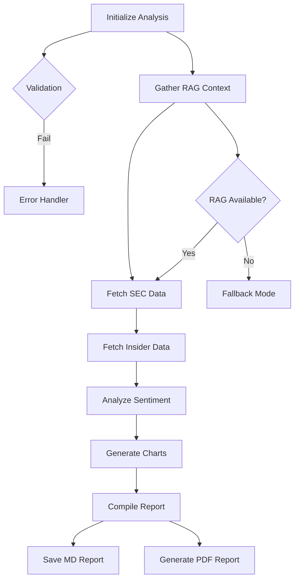

# CrewAI Financial Intelligence System

A comprehensive backend system using CrewAI framework for sentiment analysis and SEC insider trading monitoring with advanced LLM integration and RAG capabilities.

## 🚀 Features

- **Real-time SEC Filings Analysis** - Monitors Forms 8-K, 10-Q, 10-K, and Form 4 filings
- **Insider Trading Pattern Recognition** - Distinguishes between planned (10b5-1) and discretionary trades
- **Real Sentiment Analysis** - Uses TextBlob NLP for analyzing X (Twitter) financial influencers
- **RAG Integration** - ChromaDB vector store with historical document context
- **LLM-Enhanced Insights** - GPT-powered analysis for deeper market intelligence
- **Professional Visualizations** - Comprehensive charts with matplotlib and seaborn
- **Multi-format Reports** - Generates both Markdown and PDF reports with embedded charts
- **CrewAI Flow with Guardrails** - Robust error handling and process validation

## 📋 Requirements

### Python Dependencies

```bash
pip install crewai litellm requests beautifulsoup4 matplotlib pandas seaborn
pip install tweepy python-dotenv reportlab textblob transformers torch
pip install chromadb sentence-transformers langchain-community faiss-cpu
```

### Environment Variables

Create a `.env` file in the project root:

```env
OPENAI_API_KEY=your-openai-api-key-here
TWITTER_BEARER_TOKEN=your-twitter-bearer-token
```

**Note**: The system includes fallback modes if API keys are not configured.

## 🏗️ Project Structure

```
crewai-trading-system/
├── crewai_trading_system.py    # Main application
├── .env                        # Environment variables
├── README.md                   # This file
├── charts/                     # Generated charts
├── reports/                    # Generated reports (MD & PDF)
├── logs/                       # Application logs
├── data/                       # Database and data files
├── rag_data/                   # RAG vector store
└── requirements.txt            # Python dependencies
```

## 🔧 Installation & Setup

### 1. Clone and Setup Environment

```bash
# Clone the repository (or create new directory)
mkdir crewai-trading-system
cd crewai-trading-system

# Create virtual environment (recommended)
python -m venv crewai_env
source crewai_env/bin/activate  # On Windows: crewai_env\Scripts\activate

# Install dependencies
pip install -r requirements.txt
```

### 2. Configure Environment Variables

```bash
# Copy the main script
cp crewai_trading_system.py .

# Create .env file
echo "OPENAI_API_KEY=your-openai-api-key-here" > .env
echo "TWITTER_BEARER_TOKEN=your-twitter-bearer-token" >> .env
```

### 3. Initialize TextBlob (First Time Only)

```bash
python -c "import nltk; nltk.download('punkt')"
```

## 🚀 Usage

### Quick Start

```bash
python crewai_trading_system.py
```

### Execution Options

When you run the script, you'll see a menu:

```
Select execution method:
1. Enhanced Flow-based Analysis (Recommended)
2. Traditional Crew-based Analysis  
3. Test Individual Components
```

**Option 1**: Uses CrewAI Flow with comprehensive guardrails and LLM integration
**Option 2**: Uses traditional CrewAI Crew approach
**Option 3**: Tests individual components (RAG, LLM, tools)

### Expected Output

The system will generate:

1. **Comprehensive Charts** in `charts/` directory:
   - `insider_trading_comprehensive.png` - Multi-panel trading analysis
   - `sentiment_comprehensive.png` - Multi-panel sentiment analysis

2. **Reports** in `reports/` directory:
   - `trading_analysis_report_YYYYMMDD_HHMMSS.md` - Markdown report
   - `trading_analysis_report_YYYYMMDD_HHMMSS.pdf` - PDF report with embedded charts

3. **Logs** in `logs/` directory:
   - `crewai_analysis.log` - Detailed execution logs

## 🤖 CrewAI Agents Architecture

### Agent Responsibilities

1. **SEC Data Intelligence Specialist**
   - Fetches and analyzes SEC filings
   - Identifies significant corporate events
   - Tools: SECDataTool, RAGTool

2. **Insider Trading Intelligence Analyst**
   - Monitors Form 4 filings
   - Distinguishes planned vs discretionary trades
   - Tools: InsiderTradingTool, RAGTool

3. **Data Visualization Specialist** 
   - Creates comprehensive comparison charts
   - Performs trend analysis
   - Tools: ChartGeneratorTool, RAGTool

4. **Social Media Sentiment Analyst**
   - Real sentiment analysis using TextBlob
   - Monitors key financial influencers
   - Tools: RealSentimentAnalysisTool, RAGTool

5. **Senior Financial Report Writer**
   - LLM-enhanced report generation
   - Synthesizes all data sources
   - Tools: RAGTool

6. **Financial Document Research Specialist**
   - RAG-powered historical context
   - Document similarity search
   - Tools: RAGTool

### Flow Architecture with Guardrails



## 🔍 RAG Integration Details

### Document Types Indexed

- **SEC Filings**: Sample Form 8-K, 10-Q, and Form 4 filings
- **Market Research**: Insider trading pattern analysis reports
- **YouTube Transcripts**: Financial analysis video transcripts
- **Historical Context**: Previous market events and patterns

### Vector Store Configuration

- **Database**: ChromaDB persistent storage
- **Embeddings**: sentence-transformers/all-MiniLM-L6-v2
- **Similarity Search**: Cosine similarity with top-5 results
- **Storage Path**: `rag_data/chroma_db/`

### Query Examples

```python
# Historical context queries
"SEC filings insider trading patterns recent trends"
"market sentiment analysis financial influencers" 
"quarterly earnings reports impact analysis"
"corporate governance changes executive transactions"
```

## 📊 Sample Input/Output

### Input Configuration

```python
# X (Twitter) Creators Analyzed
X_CREATORS = [
    "@elonmusk", "@chamath", "@naval", "@balajis", "@APompliano",
    "@cz_binance", "@VitalikButerin", "@aantonop", "@coindesk", "@cointelegraph"
]

# Analysis Time Frame
ANALYSIS_PERIOD = 24  # hours

# LLM Configuration
LLM_MODEL = "gpt-3.5-turbo"
LLM_TEMPERATURE = 0.3
```

### Sample Output

#### Console Output
```
================================================================================
CrewAI-powered Financial Intelligence System
================================================================================

Select execution method:
1. Enhanced Flow-based Analysis (Recommended)
2. Traditional Crew-based Analysis
3. Test Individual Components

Enter your choice (1-3): 1

🚀 Starting Enhanced Flow-based Analysis...

2025-01-15 10:30:15 - INFO - Starting enhanced trading analysis flow...
2025-01-15 10:30:16 - INFO - All necessary directories created/verified
2025-01-15 10:30:17 - INFO - Enhanced environment validation completed
2025-01-15 10:30:18 - INFO - RAG system verification successful
2025-01-15 10:30:19 - INFO - LLM connectivity test successful
2025-01-15 10:30:20 - INFO - Gathering RAG context for analysis...
2025-01-15 10:30:22 - INFO - Fetching enhanced SEC data...
2025-01-15 10:30:24 - INFO - Fetching enhanced insider trading data...
2025-01-15 10:30:26 - INFO - Analyzing sentiment using real NLP...
2025-01-15 10:30:28 - INFO - Generating comprehensive charts...
2025-01-15 10:30:32 - INFO - Compiling comprehensive report with LLM enhancement...
2025-01-15 10:30:45 - INFO - Comprehensive report saved to reports/trading_analysis_report_20250115_103045.md and reports/trading_analysis_report_20250115_103045.pdf

================================================================================
ANALYSIS RESULTS
================================================================================
Status: completed
Markdown Report: reports/trading_analysis_report_20250115_103045.md
PDF Report: reports/trading_analysis_report_20250115_103045.pdf
Analysis Duration: 0:00:30.123456

✅ System execution completed
📊 Charts saved in: charts/
📄 Reports saved in: reports/
📝 Logs saved in: logs/
================================================================================
```

#### Generated Report Sample

```markdown
# Comprehensive Financial Intelligence Report
*Generated on 2025-01-15 10:30:45*
*Analysis Duration: 0:00:30.123456*
*Report ID: 20250115_103045*

## Executive Summary

Based on comprehensive analysis of SEC filings, insider trading activity, and social media sentiment from key financial influencers, the current market environment shows:

- **Moderate insider selling activity** across major tech companies with total transaction value of $56.7M
- **Cautiously optimistic sentiment** among financial influencers (average score: +0.34)
- **Increased SEC filing activity** with 4 significant filings in the past 24 hours
- **No unusual trading patterns** detected, with most transactions following established Pass| B
    H -->|
